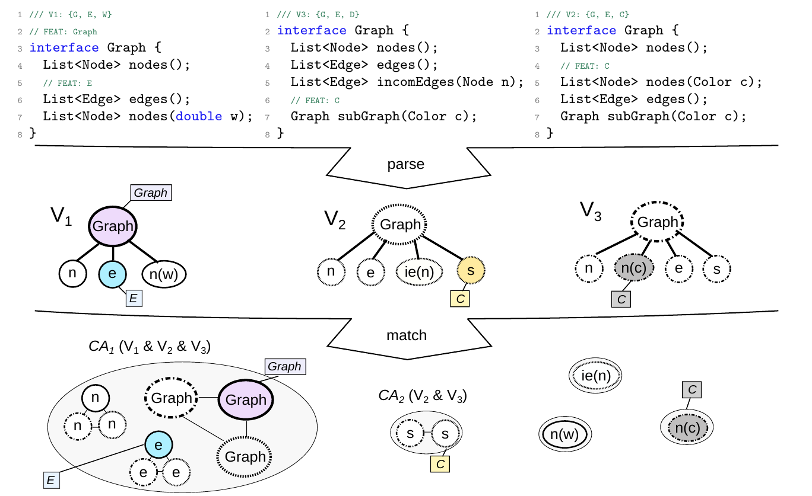

[](https://variantsync.github.io/trace-boosting/)

# trace-boosting: Give an Inch and Take a Mile? Effects of Adding Reliable Knowledge to Heuristic Feature Tracing

## Overview
This research artifact contains the boosted retroactive comparison-based feature tracing algorithm as presented in our [SPLC 2024 paper]().

In the paper, we explore how minimal seeds of proactive feature traces enhance the accuracy of automated, heuristic-based retroactive tracing. 
Our results demonstrate that only small amounts of proactive feature information can boost the overall accuracy of the tracing and 
that the number of variants compared affects the effectiveness of the boosted tracing approach.



TraceBoosting, as sketched conceptually in above figure, is an algorithm designed to enhance retroactive feature tracing with proactively collected feature traces. 
Particularly, this implementation compares multiple variant variants which are _parsed_ into artifact trees (V1-V3).
It builds sets of co-occurring artifacts (CA1-CA5) by matching the tree nodess and edges and computes sets of possible and impossible features for these co-occurring artifact sets 
based on the respective configuration in which the tree elements occur.
This heuristic retroactive comparison-based tracing method is inspired by the algorithm used in the tool [ECCO](https://jku-isse.github.io/ecco/).

To increase the accuracy and efficiency of the heuristic algorithm, 
we integrate proactive knowledge (represented as rectangles attached to artifact nodes in above figure).
Each time a proactive feature trace is available in a co-occuring artifact set and does not contradict another proactive trace, 
the expression of the proactive trace is mapped onto all artifact nodes in the set. 
In this way, we can propagate the highly reliable knowledge of the proactive trace, 
provided typically by humans, to the remaining artifact nodes in a co-occuring artifact set and, thus, essentially 
spread the information across variants overriding the heuristcally determined annotation.

## Dependencies
- [Java using JDK17 or newer](https://www.oracle.com/java/technologies/downloads/)
- [Maven](https://maven.apache.org/)

## Setup Using Maven
Clone the repository to a directory of your choice: 
```sh
git clone https://github.com/VariantSync/trace-boosting.git
```

Navigate into the root of the repository and install it using [Maven](https://maven.apache.org/).
```sh
cd trace-boosting 
mvn install 
```

After installation, you can include the TraceBoosting library in your Maven project. 
Add the following dependency to your `pom.xml` file:

```xml
<dependency>
    <groupId>org.variantsync</groupId>
    <artifactId>traceboosting</artifactId>
    <version>1.0.0</version>
</dependency>
```

## Usage
To use the TraceBoosting algorithm, follow these steps:

1. Initialize an empty list to hold `VariantPassport` objects that comprise the artifact locations for each variant.
2. Iterate the collection of variants for which traces are to be computed, create a `VariantPassport` for each variant and add it to the list.
3. Instantiate the TraceBoosting algorithm with 
   - the list of variant passports, 
   - the working directory, and 
   - the 'language' used for parsing in the tracing algorithm (e.g. a generic, line-based parsing of lines into artifact nodes).
4. Retrieve the list of variants from the TraceBoosting instance, which are abstracted as AST structures.
5. Apply the proactively collected feature traces to the variants by settings the mappings for the respective nodes in the variants' AST.
6. Compute the Main tree, which represents the AST with feature traces, resulting from merging the variants.

The following code snippet demonstrates how to use the TraceBoosting algorithm:

```java
List<VariantPassport> variantPassports = new ArrayList<>();
for (Variant variant : variants) {
    String variantName = variant.getName();
    variantPassports.add(new VariantPassport(variantName,
            variantsDirectory.resolve(variantName), configFileMap.get(variantName)));
}

TraceBoosting traceBoosting = new TraceBoosting(variantPassports,
        workingDirectory, ESupportedLanguages.LINES);

List<Variant> variants = traceBoosting.getVariants();

// Now apply proactively created traces to the variants. You can directly access the AST nodes of the variants.
distributeMappings(variants)

// Finally, execute the boosting algorithm
MainTree mainTree = traceBoosting.computeMapping();
```
